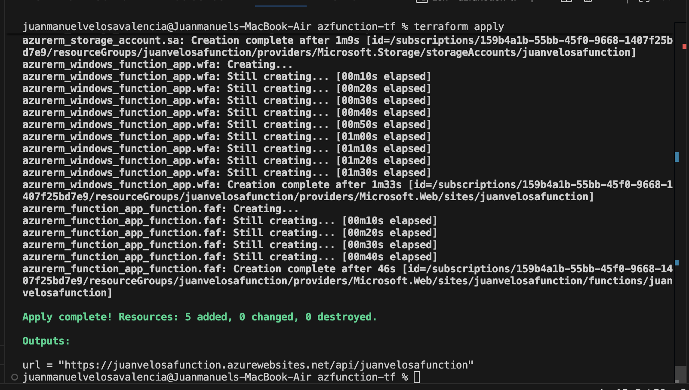
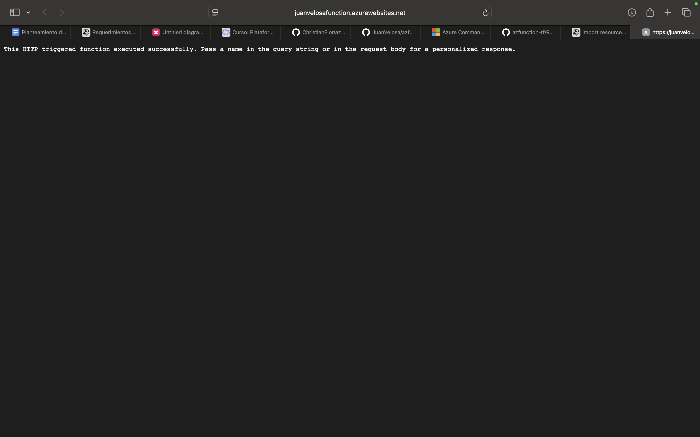

# Despliegue de un Web Server en Azure con Terraform

## Introducción
Este documento explica el proceso que seguí para desplegar un servicio en **Azure** utilizando **Terraform**.  
Se detalla paso a paso cómo realicé el despliegue, desde la clonación del repositorio hasta la verificación final en el portal de Azure.

---

## Pasos realizados

### 1. Fork y clonación del repositorio
Primero realicé un **fork** al repositorio del profesor y luego ejecuté un **git clone** para tenerlo en mi máquina local:

```bash
git clone <https://github.com/JuanVelosa/azfunction-tf.git>
```

---

### 2. Inicio de sesión en Azure
Ejecuté el siguiente comando para autenticarme en Azure y obtener las credenciales:

```bash
az login
```

Posteriormente, utilicé esas credenciales y las quemé directamente en el archivo `main.tf`.

---

### 3. Modificación de variables
Actualicé la variable por defecto de `location` en el archivo `variables.tf`, cambiándola por **eastus2**:

```hcl
variable "location" {
  default = "eastus2"
}
```

---

### 4. Ejecución de comandos Terraform
Con la configuración lista, ejecuté los siguientes comandos en orden:

```bash
terraform init
terraform plan
terraform apply
```




En el comando `terraform plan` asigné como valor el nombre del recurso **juanvelosafunction**.

---

### 5. Validación en Azure
Finalmente, validé en el **portal de Azure** que el servicio había sido creado exitosamente. 
Subí una imagen como comprobante de que efectivamente el servicio quedó desplegado.




---

## Conclusión
El despliegue del servicio en Azure fue exitoso.  
El procedimiento consistió en:
- Realizar el fork y clonación del repositorio.  
- Iniciar sesión en Azure y usar las credenciales.  
- Modificar la ubicación a **eastus2**.  
- Ejecutar los comandos `terraform init`, `terraform plan` y `terraform apply`.  
- Verificar en el portal que el servicio se creó correctamente.


De esta manera, logré montar el servicio paso a paso utilizando Terraform en Azure.
